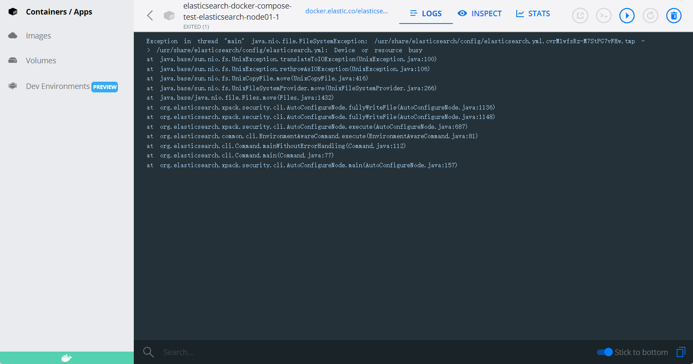

- This repository is associated with the issue.
- After installing docker desktop under windows, execute the following command to reproduce.
```shell
wsl -d docker-desktop

sysctl -w vm.max_map_count=262144

docker compose up -d

# use `docker compose down --volumes` to remove it.
```
- The follow is elasticsearch log
```shell
Exception in thread "main" java.nio.file.FileSystemException: /usr/share/elasticsearch/config/elasticsearch.yml.cvrM1wfsRz-M7StPG7vFHw.tmp -> /usr/share/elasticsearch/config/elasticsearch.yml: Device or resource busy

at java.base/sun.nio.fs.UnixException.translateToIOException(UnixException.java:100)

at java.base/sun.nio.fs.UnixException.rethrowAsIOException(UnixException.java:106)

at java.base/sun.nio.fs.UnixCopyFile.move(UnixCopyFile.java:416)

at java.base/sun.nio.fs.UnixFileSystemProvider.move(UnixFileSystemProvider.java:266)

at java.base/java.nio.file.Files.move(Files.java:1432)

at org.elasticsearch.xpack.security.cli.AutoConfigureNode.fullyWriteFile(AutoConfigureNode.java:1136)

at org.elasticsearch.xpack.security.cli.AutoConfigureNode.fullyWriteFile(AutoConfigureNode.java:1148)

at org.elasticsearch.xpack.security.cli.AutoConfigureNode.execute(AutoConfigureNode.java:687)

at org.elasticsearch.common.cli.EnvironmentAwareCommand.execute(EnvironmentAwareCommand.java:81)

at org.elasticsearch.cli.Command.mainWithoutErrorHandling(Command.java:112)

at org.elasticsearch.cli.Command.main(Command.java:77)

at org.elasticsearch.xpack.security.cli.AutoConfigureNode.main(AutoConfigureNode.java:157)
```
- 